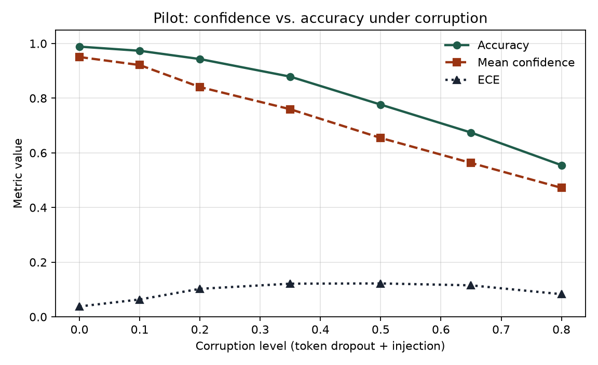
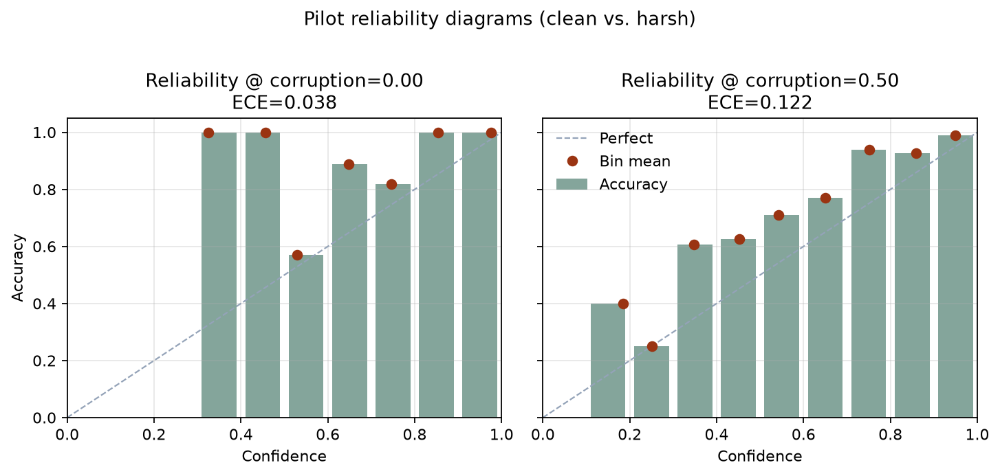

# Pilot: confidence vs. accuracy under token corruption

**Status:** Pilot complete · full study in progress  
**Author:** Victor E. Birkle III  
**Date:** August 2026  
**Code:** [`research/code/pilot_confidence_drift.py`](./code/pilot_confidence_drift.py)  
**Metrics:** [`research/pilot_metrics.json`](./pilot_metrics.json)  
**Analysis report / CSVs:** [`research/reports/`](./reports/)

This is a **first-pass toy study**. It answers a shrink-wrapped version of the fuller question in [`confidence-accuracy-divergence.md`](./confidence-accuracy-divergence.md). It is not a production ASR/NLU result.

---

## Question (pilot scope)

As controlled input corruption increases, does a simple intent classifier’s **reported confidence track accuracy**, or does calibration degrade — and in which direction (over- vs under-confidence)?

## Setup

| Piece | Choice |
|-------|--------|
| Data | Synthetic 8-class “intent” utterances (templates + lexical bleed across classes) |
| Size | 1,760 utterances → 1,232 train / 528 test (seed 42) |
| Model | `CountVectorizer` (1–2 grams) + `LogisticRegression` |
| Corruption | Token dropout (~0.85×level) + random in-vocab injection |
| Metrics | Accuracy, mean max-softmax confidence, 10-bin ECE |

Reproduce:

```bash
python -m venv .venv && source .venv/bin/activate
pip install -r research/code/requirements.txt
python research/code/pilot_confidence_drift.py
```

---

## Findings



| Corruption | Accuracy | Mean confidence | ECE | Conf − Acc |
|------------|----------|-----------------|-----|------------|
| 0.00 | 0.989 | 0.951 | 0.038 | −0.038 |
| 0.20 | 0.943 | 0.841 | 0.103 | −0.103 |
| 0.50 | 0.777 | 0.655 | 0.122 | −0.122 |
| 0.80 | 0.555 | 0.472 | 0.083 | −0.083 |



### What held

- Accuracy falls smoothly as corruption rises — the corruption knob works.
- ECE rises from ~0.04 (clean) to ~0.12 mid-corruption, then shrinks again as both accuracy and confidence collapse toward chance-ish behavior.

### What surprised me

- **The model became underconfident, not overconfident.** Mean confidence stayed *below* accuracy at every level (`conf − acc` is negative). Production memory from conversational pipelines was the opposite pattern: confidence staying high while quality slipped. This toy did **not** reproduce that failure mode.

### What didn’t work / inconclusive

- Token dropout + vocab injection is a poor proxy for ASR noise or class-prior shift. It mostly destroys evidence the linear model uses, so softmax mass spreads out (underconfidence) instead of concentrating on a wrong class.
- Clean accuracy (~0.99) is still too easy despite lexical bleed — the pilot understates how messy real intent text is.
- Operational-signal detectors (SNR proxies, length, prior-shift flags) were **not** tested here; that belongs to the fuller study.

---

## Honest limitation

A finished pilot that fails to recreate the target pathology is still useful: it shows the loop (question → method → result → limitation) and sharpens the next experiment. The next step is not “make the chart prettier.” It is to change the corruption model toward mechanisms that can produce **high-confidence errors** (label-preserving acoustic/channel noise, domain shift, and prior shift), then re-measure ECE and reliability.

## Next step (full study)

See [investigation plan](./) / [`confidence-accuracy-divergence.md`](./confidence-accuracy-divergence.md): production-shaped ASR→NLU conditions, operational features as predictors of `|confidence − correctness|`, and an explicit search for when confidence stops being a trustworthy signal.
