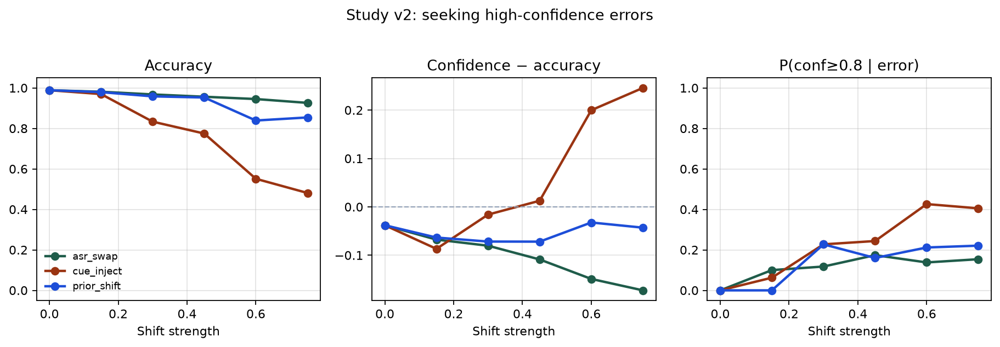
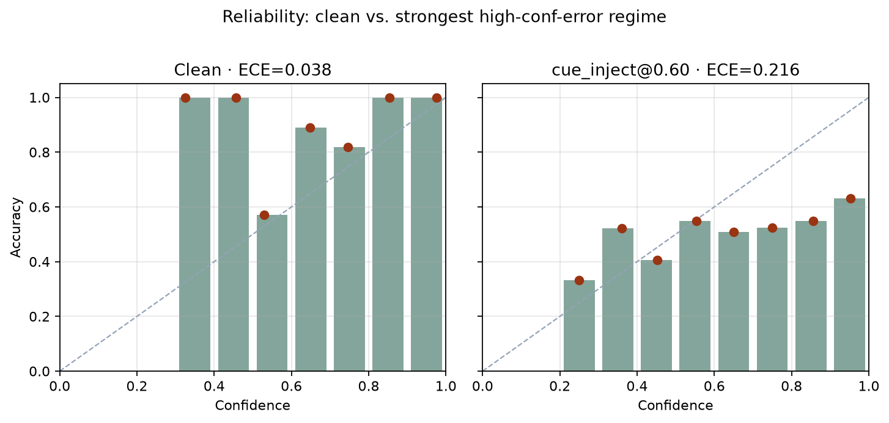

# Study v2: producing high-confidence errors

**Status:** Complete (synthetic, still not production ASR)  
**Author:** Victor E. Birkle III  
**Date:** August 2026  
**Code:** [`research/code/study_high_confidence_errors.py`](./code/study_high_confidence_errors.py)  
**Metrics:** [`research/study_v2_metrics.json`](./study_v2_metrics.json)  
**Analysis report / CSVs:** [`research/reports/`](./reports/)  
**Follows:** [Pilot](./pilot.md) (token dropout → underconfidence)

---

## Question

Which **label-preserving** shifts make a simple intent classifier emit **high-confidence wrong answers** — the failure mode the pilot did not recreate?

## Setup

Same synthetic 8-class corpus and logistic baseline as the pilot. Three regimes:

| Regime | Mechanism |
|--------|-----------|
| `asr_swap` | Replace intent keywords with near-neighbor confusions (ASR/homophone proxy) |
| `cue_inject` | Strip true-class cues (probabilistic) and splice competing-intent keywords; label unchanged |
| `prior_shift` | Resample test prior toward a few classes + mild cue injection |

Metrics: accuracy, mean confidence, ECE, confidence−accuracy gap, and **P(conf ≥ 0.8 \| error)**.

Operational probe (secondary): predict large `|confidence − correctness|` from length, corruption proxy, regime, and level — **confidence excluded**.

```bash
python research/code/study_high_confidence_errors.py
```

---

## Findings



### Headline

**Competing-intent cue injection produces the overconfidence pattern the pilot missed.**

At `cue_inject` level 0.6 (528 test rows):

| Metric | Value |
|--------|------:|
| Accuracy | 0.551 |
| Mean confidence | 0.751 |
| Confidence − accuracy | **+0.200** |
| ECE | 0.216 |
| Errors | 237 |
| P(conf ≥ 0.8 \| error) | **0.426** |

So when rival keywords are injected and true cues stripped, confidence stays high while accuracy collapses — ~43% of mistakes still look “sure.”



### What each regime did

- **`asr_swap`:** Still mostly *underconfident* (gap negative). Accuracy stays high; high-conf error share stays modest (~10–15%). Homophone swaps alone were a weak path to the target pathology on this bag-of-words model.
- **`cue_inject`:** Gap flips positive above ~0.45; ECE and high-conf error rate climb. This is the regime that matches production memory.
- **`prior_shift`:** Accuracy dips some at high skew; does **not** systematically create overconfidence. Prior change alone is not enough here.

### Operational probe

AUC **0.72** predicting large confidence/correctness mismatch from operational features only (no labels, no confidence). Strongest coefficients: corruption proxy and shift level. Length barely mattered. Useful as a weak early-warning signal — not a solved detector.

### What surprised me

- The pilot’s token-dropout story and this cue-injection story are opposites on the same model. **Corruption type decides the calibration failure mode.**
- Prior shift was a bust for high-confidence errors. I expected prevalence change to inflate confidence on majority classes more than it did.

### What didn’t work / limits

- Still synthetic text, not real ASR lattices or production logs.
- Cue injection is a strong, somewhat artificial attack; it proves the measurement loop can catch the pathology, not that this exact mechanism is what OpenCity saw.
- Operational AUC 0.72 is only moderate; do not overclaim detectability.

---

## Relation to the fuller plan

This closes the immediate gap left by the pilot: we now have a finished, honest example of **high-confidence wrong answers under label-preserving shift**, plus a negative result on prior-shift-alone and ASR-swap-alone.

Remaining for a production-faithful pass: real ASR noise, domain-shifted natural language, and holdout operational detectors trained without peeking at the evaluation regime labels.
